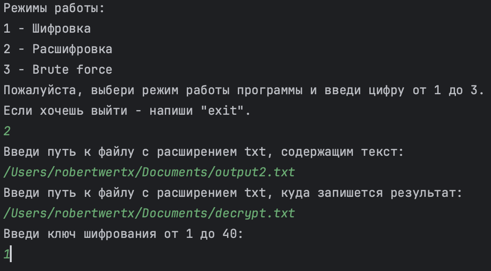

**Результат работы программы:**

*При запуске программы пользователю предлагаются три режима работы программы:* 

*При выборе режима шифровки пользователю нужно ввести: ключ, адрес файла с текстом и адрес, куда будет писаться шифровка:*

*В результате зашифрованный текст записывается по указанному адресу:* 

*При выборе режима расшифровки пользователю необходимо указать адреса файла с текстом, который будет расшифровываться, адрес, куда запишется результат и использованный при шифровании ключ:*

*В результате зрасшифрованный текст записывается по указанному адресу:*

*При выборе режима брут форс, пользователю необходимо ввести адрес файла с зашифрованным текстом и адрес файла, куда запишется результат:*

*В результате расшифрованный перебором текст записывается по указанному адресу:*

